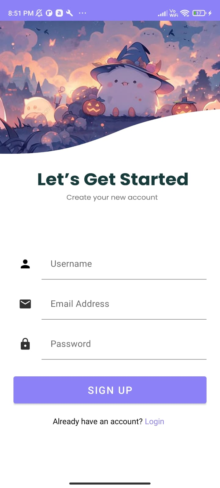

# 📱 Cadence – Android Chat Application

Cadence is a modern, real-time chat application built using **Android Studio** and **Firebase**. It focuses on a clean UI, smooth authentication flow, and secure real-time messaging. The app is designed with a friendly and aesthetic interface, making conversations feel natural and engaging.

---

## ✨ Features

* 🔐 **Firebase Authentication** (Login & Sign Up)
* 💬 **Real-time Chat** using Firebase Realtime Database / Firestore
* 👤 **User Accounts** with Username & Email
* 🎨 **Modern UI Design** with custom illustrations
* 📱 **Responsive Layouts** for different screen sizes
* ☁️ **Cloud-based Backend** (Firebase)

---

## 🖼️ App Screenshots

### 🔑 Login Screen

.jpeg)

### 📝 Sign Up Screen



> *These screens show the clean authentication flow of Cadence with friendly illustrations and minimal UI.*

---

## 🛠️ Tech Stack

### Frontend (Android)

* **Language:** Java / Kotlin
* **IDE:** Android Studio
* **UI:** XML Layouts, Material Design Components

### Backend (Firebase)

* **Firebase Authentication** – User Login & Sign Up
* **Firebase Realtime Database / Firestore** – Chat messages & users
* **Firebase Storage** *(optional)* – Profile images

---

## 🔐 Authentication Flow

1. User opens the app
2. Existing users log in using **email & password**
3. New users create an account via **Sign Up**
4. Firebase authenticates and stores user data securely
5. User is redirected to the chat interface

---

## 📂 Project Structure (Simplified)

```
Cadence/
│
├── activities/
│   ├── LoginActivity
│   ├── SignupActivity
│   └── ChatActivity
│
├── adapters/
├── models/
├── layouts/
│   ├── activity_login.xml
│   ├── activity_signup.xml
│   └── activity_chat.xml
│
├── utils/
└── Firebase config files
```

---

## 🚀 How to Run the Project

1. Clone the repository
2. Open the project in **Android Studio**
3. Connect the app to **Firebase Console**

   * Enable Authentication (Email/Password)
   * Create Firestore / Realtime Database
4. Add `google-services.json` to the app folder
5. Sync Gradle and run the app on an emulator or physical device

---

## 🔮 Future Enhancements

* ✅ One-to-one & group chats
* 🟢 Online / Offline status
* 📎 Media sharing (images, audio)
* 🔔 Push notifications
* 🌙 Dark mode

---

## 👩‍💻 Developed By

**Shruti Verma**
B.Tech CSE Student
Android Developer | UI/UX Enthusiast

---

## 📜 License

This project is for educational and personal use.

---

> 💜 *Cadence is built with the idea that every conversation has a rhythm — let yours flow.*
